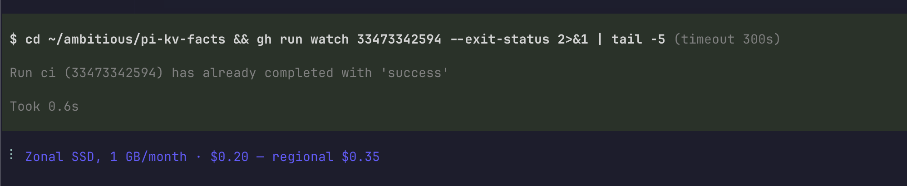

# pi-kv-facts

A [pi](https://pi.dev) extension that shows one short fact per turn on the working spinner, while the agent thinks.



A fact is a `(prompt, answer)` row in SQLite. The bundled database holds napkin math — latency, throughput, cloud cost, powers of two — but any facts work: your service SLOs, deploy times, API limits.

```
Random SSD read, 8 KiB · 100 µs, 70 MiB/s
Internet egress, 1 GB · $0.10
M/M/1 queue at 90% load · wait = 9x service time
```

## Install

```bash
pi install npm:pi-kv-facts
```

Numbers appear on the next turn. There is no command and no import tool: the data is a SQLite file, so `sqlite3` is the interface.

## The database

One file, one table. `topic` and `source` are optional.

```sql
CREATE TABLE facts (prompt TEXT PRIMARY KEY, answer TEXT NOT NULL, topic TEXT, source TEXT);
```

The extension reads exactly one database, the first of these that it finds:

1. `$PI_KV_FACTS_DB`
2. `~/.pi/kv-facts/facts.db`
3. the bundled `data/facts.db`

`prompt` is the primary key, so the schema keeps facts unique. Nothing in the extension dedupes.

## Add your own facts

Copy the bundled database once, then insert into it:

```bash
mkdir -p ~/.pi/kv-facts
cp "$(npm root -g)/pi-kv-facts/data/facts.db" ~/.pi/kv-facts/facts.db

sqlite3 ~/.pi/kv-facts/facts.db \
  "INSERT OR REPLACE INTO facts (prompt, answer, topic)
   VALUES ('Deploy to production', '6 min', 'team')"
```

Pulling facts out of another database works the same way:

```bash
sqlite3 ~/.pi/kv-facts/facts.db \
  "ATTACH 'other.db' AS src;
   INSERT OR IGNORE INTO facts (prompt, answer) SELECT prompt, answer FROM src.facts"
```

Keep each line short. A row is skipped when `prompt + answer + 3` is over the width budget, and blank answers never show.

## Settings

Environment variables, all optional.

| Variable | Effect |
|---|---|
| `PI_KV_FACTS_SPINNER=off` | keep pi's default spinner text |
| `PI_KV_FACTS_COLOR=off` | print in the theme color |
| `PI_KV_FACTS_WIDTH` | line budget in characters (default 56) |
| `PI_KV_FACTS_TOPICS` | keep some topics, for example `cost,network` |
| `PI_KV_FACTS_DB` | read this database instead |

## How it picks

Nothing is loaded into memory. Each turn runs one indexed query: a random rowid, then the first matching row at or after it. Rows that follow a gap in the rowids come up slightly more often, which no one can see on a spinner.

## The bundled numbers

91 facts in 9 topics.

| Topics | Facts | Origin |
|---|---|---|
| `cpu`, `disk`, `network`, `blob`, `cost`, `compression` | 68 | [sirupsen/napkin-math](https://github.com/sirupsen/napkin-math), re-measured 2026-03, and the classic Jeff Dean latency list |
| `powers`, `availability`, `rules` | 23 | arithmetic from those rows |

Numbers are rounded for memory, not for precision. Read the exponent, not the digits.

## Develop

```bash
npm install
npm run check   # typecheck and tests
```

## License

MIT
